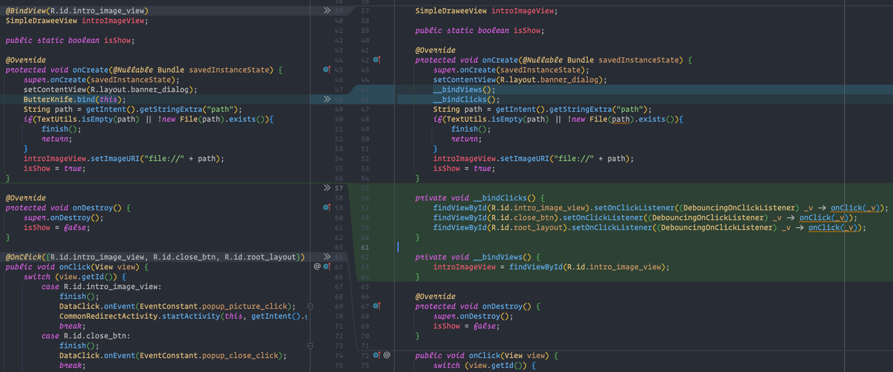
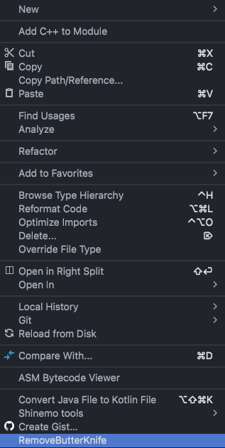

## RemoveButterKnife - Android Studio Plugin

> 一个能够一键批量去除Android老项目中的Java类里Butterknife相关依赖的插件✂️, 老项目迁移利器🔥

### 0. 引子

- ButterKnife已在2020年停止了更新, 开发者JakeWharton也不再推荐使用该库
- ButterKnife对组件化的支持不友好
- ButterKnife对AndroidX的支持不友好

因此, 在进行老项目升级改造和组件化的时候, 有一个快速剔除ButterKnife库依赖的工具将极大的提升效率, 为此, 我在公司内部进行改造时开发了这款插件, 并在之后将其开源, 希望能帮到你

---

### 1. 插件功能预览

> 上图左侧为老代码, 右侧是经过处理后的代码

### 2. 插件的主要功能

- 将`@BindView(id)`注解转换成`findViewById(id)`
- 将`@OnClick(id)`注解转换成`setOnClickListener()`
- 在合适的位置插入`__bindClicks()`和`__bindViews()`

- 替换`butterknife.internal.DebouncingOnClickListener`为自己定义的

### 3. 安装

- 在[Releases](https://github.com/Joehaivo/RemoveButterKnife/releases)中找到最新版本的Jar文件下载到本地

- 打开`Android Studio` > `Preferences(MacOS)/Settings(Windows)` > `Plugins` > `Install Plugin from Disk...(右上角小齿轮⚙️)` 找到刚才的Jar包安装

### 4. 使用

>  **使用之前, 需要先把`butterknife.internal.DebouncingOnClickListener`类单独拷贝一份出来修改包名后放在项目中, 新的包名不能再包含`butterknife`, 类名不要改, 例如`com.example.biz.DebouncingOnClickListener`**

- 单独处理: 在需要处理的`Java`文件上右键，在展开的菜单底部找到"RemoveButterKnife"点击.
- 批量处理整个文件夹: 在需要处理的`文件夹`上右键，找到"RemoveButterKnife"点击.
- 多选: 按住`Command`/`Ctrl`键再选择好需要处理的`Java`文件，右键, 找到"RemoveButterKnife"点击.

